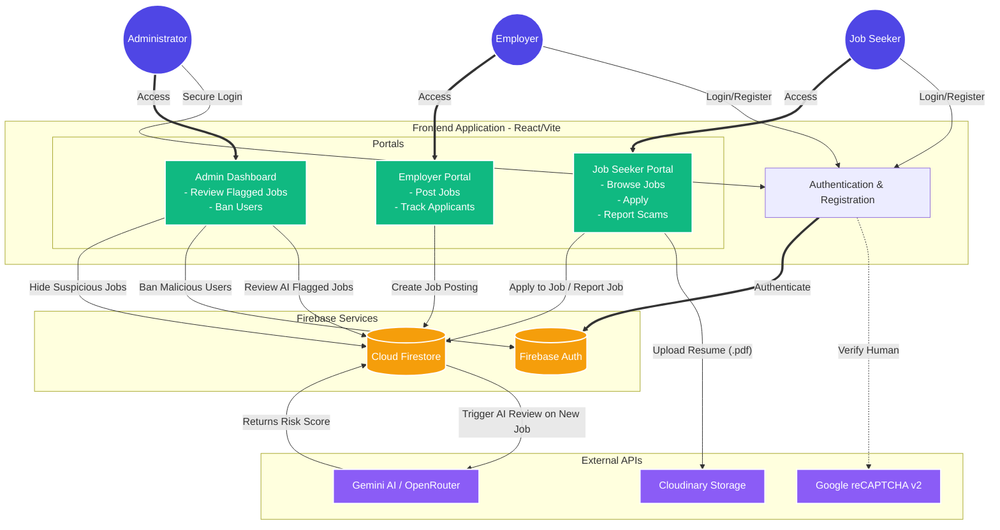

# SafeHire India Project Architecture

Here is the top-to-bottom architecture and data flow diagram of the SafeHire India platform, outlining how users interact with the frontend, and how it connects to the backend and external services.

